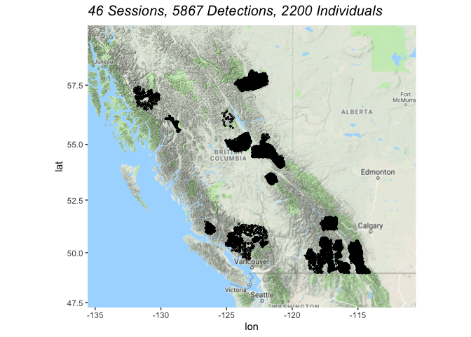

Provincial Grizzly Bear Meta Analysis: Drivers of Density
================
Clayton T. Lamb, PhD Student, University of Alberta
09 May, 2020

### Load Data

``` r
library(oSCR)
library(here)
library(raster)
library(sf)
library(velox)
library(viridis)
library(stringr)
library(rgdal)
library(ggmap)
library(fasterize)
library(huxtable)
library(knitr)
library(tidyverse)
options(scipen=999)

##official coordinate system
off.crs <-"+proj=aea +lat_1=50 +lat_2=58.5 +lat_0=45 +lon_0=-126 +x_0=1000000 +y_0=0 +datum=NAD83 +units=m +no_defs +ellps=GRS80 +towgs84=0,0,0"

###MULTISESSION
filelist = list.files(here::here("Data_Prep","CleanData","CapHists_SECR","CapData"),pattern = ".*.txt", full.names = TRUE)
filelist <- filelist[c(-13,-22, -23)]


caps <- filelist%>%
  map_df(read_csv)%>%
  as.data.frame()

colnames(caps) <- c("Session", "ID", "Occassion","Detector", "Sex")

caps <- mutate(caps, Detector=paste(Detector, Session, sep="_"))

k <-caps%>%
  group_by(Session)%>%
  summarize(max=max(Occassion))%>%
  pull(max)

rtculls<-data.frame()

filelist = list.files(here::here("Data_Prep","CleanData","CapHists_SECR","TrapData"),pattern = ".*.txt", full.names = TRUE)
filelist <- filelist[c(-13,-22, -23)]
filenames <- list.files(here::here("Data_Prep","CleanData","CapHists_SECR","TrapData"),pattern = ".*.txt", full.names = FALSE)
filenames <- filenames[c(-13,-22, -23)]
#filelist <- filelist[c(34)]
trap.list <- list()
n <-c()
for(i in 1:length(filelist)){
  a <- read_csv(filelist[i])
  colnames(a) <- c("Detector", "X", "Y", "Usage_1", "Trap_Type")
  a$sep="/"
  a <- a%>%mutate(Trap_Type=str_split(Trap_Type, "/", simplify = TRUE)[,2])%>%
    select("Detector", "X", "Y", "Usage_1", "sep", "Trap_Type")%>%
    mutate(Detector=paste(Detector, str_split(filenames[i], ".txt", simplify = TRUE)[,1], sep="_"))

  # rtculls <- a%>%filter(Trap_Type%in%" RT")%>%
  #   select(Detector)%>%
  #   rbind(rtculls)
  # 
  # a <-  a%>%filter(!Trap_Type%in%" RT")%>%
  #   select("Detector", "X", "Y", "Usage_1", "sep", "Trap_Type")
  # 
    a <-  a%>%select("Detector", "X", "Y", "Usage_1", "sep", "Trap_Type")
  
  use.len <-nchar(a$Usage_1[1])
  a <- tidyr::separate(a,Usage_1, into=paste("Usage",c(1:use.len), sep="_"),sep =c(1:(use.len-1)))
  
  trap.list[[i]]<- as.data.frame(a)
  
  n[i]<-length(unique(a$Detector))
  
}

# caps<- caps%>%
#   filter(!Detector %in%rtculls$Detector)
```

Summary of Detections and Spatial Recaptures
--------------------------------------------

``` r
length(unique(caps$ID))
length(unique(caps$Session))
length(trap.list)
#lapply(trap.list, function(x) nrow(x))
# trap.bind <- data.frame()
# for(i in 1:13){
#   trap.bind <-rbind(trap.bind, as.data.frame(trap.list[[i]]))
# }
# sum(!unique(caps$Detector)%in%trap.bind$Detector)
```

Map
---

``` r
####MAP
df <- bind_rows(trap.list)%>%
  select(X,Y, Detector, Trap_Type)%>%
  st_as_sf(coords = c("X","Y"),
           crs = off.crs)%>%
  st_transform("+init=epsg:4326 +proj=longlat +datum=WGS84 +no_defs +ellps=WGS84 +towgs84=0,0,0")%>%
  cbind(st_coordinates(.))%>%
  as_tibble()%>%
  left_join(caps, by="Detector")%>%
  mutate(ID=as.factor(ID))

##make bounding box to extract google maps data with
bbox <- make_bbox(X, Y, df, f = 0.6)

##then one to clip with
bbox_clip <- make_bbox(X, Y, df, f = 0.2)

##prep info about project, sessions, captures, etc

occ<-paste( length(unique(caps$Session)) ,"Sessions,",sep=" ")
det<-paste(nrow(caps),"Detections,",sep=" ")
ind<-paste(length(unique(caps$ID)),"Individuals",sep=" ")

line<-paste(occ,det,ind,sep=" ")

##PLOT
# register_google("Add your google API here")
# basemap <- ggmap::get_map(location = bbox)
# saveRDS(basemap,here::here("Data_Prep", "Spatial_Layers_ProvSECR", "basemap.rds"))
basemap <- readRDS(here::here("Data_Prep", "Spatial_Layers_ProvSECR", "basemap.rds"))
map <- ggmap(basemap)+
  
  geom_point(aes(x = X,
                 y = Y),
             colour = "black",
             pch = 21,
             data=df,
             size=0.5)+
  
  
  ggtitle(bquote(italic(.(line)))) +
  
  theme(plot.title = element_text(size = 15, face = "bold", colour = "black", vjust = 1),
        #legend.background = element_rect(size=0.5, linetype="solid", colour ="black"),
        legend.key = element_blank(),
        strip.text.x = element_text(size=15, face="bold"))+
  
  guides(colour = guide_legend(order = 2), 
         fill = guide_legend(order = 1))+
  
  coord_map(xlim = c(bbox_clip[1]+0.06, bbox_clip[3]-.06),ylim = c(bbox_clip[2]+0.06, bbox_clip[4]-0.06))

map
```



Summarise projects
------------------

``` r
summary.dat <-df%>%
  mutate(bs=str_split(Detector, c("BS"), simplify=TRUE)[,2],
         rt=str_split(Detector, c("RT"), simplify=TRUE)[,2],
         Project=case_when(bs==""~rt, rt==""~bs)%>%str_sub(2,-1))%>%
  mutate(Project=case_when(Project %in% "Kingcome_1997" ~ "Kingcome_1997", 
                           Project %in% "S_Purcell_1998" ~ "Jumbo_1998",
                           Project %in% "Region_2004" ~ "Squamish_Lillooet_2004",
                           Project %in% "Region_2007" ~ "South_Chilcotin_2007",
                           Project %in% "HWY3_2004" ~ "HWY3E_2004",
                           Project %in% "HWY3_2005" ~ "HWY3W_2005",
                           TRUE~Project))%>%
  
  mutate(year=str_sub(Project, -4,-1)%>%as.numeric(),
         Project=str_sub(Project, 1,-6))%>%
  group_by(Project)%>%
  mutate(m=case_when(Sex%in%"M"~paste(ID,Sex,sep="_"), TRUE~"NA"),
         f=case_when(Sex%in%"F"~paste(ID,Sex,sep="_"), TRUE~"NA"),
         unidentified=case_when(!is.na(ID) & is.na(Sex)~paste(ID,Sex,sep="_"), TRUE~"NA"),
         spat.caps=case_when(!is.na(ID)~paste(ID,Detector,Occassion, sep="_"), TRUE~"NA"),
         sites=paste(Detector,Occassion,sep="_"),
         site.bs=case_when(Trap_Type%in%" BS"~paste(Detector,Occassion,sep="_"),TRUE~"NA"),
         site.rt=case_when(Trap_Type%in%" RT"~paste(Detector,Occassion,sep="_"),TRUE~"NA"))


 summary <- summary.dat%>%
   summarise(Animals=n_distinct(ID, na.rm=TRUE),
            Males=n_distinct(m, na.rm=TRUE)-1,
            Females=n_distinct(f, na.rm=TRUE)-1,
            Unknown=n_distinct(unidentified, na.rm=TRUE)-1,
            Spatial_Recaptures=n_distinct(spat.caps, na.rm=TRUE)-1,
            Traps=n_distinct(sites, na.rm=TRUE),
            Bait_Site=n_distinct(site.bs, na.rm=TRUE)-1,
            Rub_Tree=n_distinct(site.rt, na.rm=TRUE)-1,
            years=paste0(min(year, na.rm=TRUE)%>%round(0),
                         "-",
                         max(year, na.rm=TRUE)%>%round(0)),
            year=n_distinct(year))%>%
  mutate(Years=case_when(year==1~str_sub(years,1,4),TRUE~years))%>%
  select(Project,Animals, Males, Females, Unknown,Spatial_Recaptures,Traps,Bait_Site,Rub_Tree, Years)%>%
  ungroup()
  
summary.sum <- summary%>%add_row(Project="SUMMARY",
            Animals = sum(summary$Animals),
            Males=sum(summary$Males),
            Females=sum(summary$Females),
            Unknown=sum(summary$Unknown),
            Spatial_Recaptures=sum(summary$Spatial_Recaptures),
            Traps=sum(summary$Traps),
            Bait_Site=sum(summary$Bait_Site),
            Rub_Tree=sum(summary$Rub_Tree),
            Years=paste0(min(summary.dat%>%pull(year), na.rm=TRUE)%>%round(0),
                         "-",
                         max(summary.dat%>%pull(year), na.rm=TRUE)%>%round(0)))%>%
     as_hux(add_colnames = TRUE,
         scientific=FALSE)%>%
  theme_article()%>%
  set_width(0.9)


huxtable::number_format(summary.sum) <- list(
  function(x)
    prettyNum(x,
              scientific = FALSE))


quick_docx(summary.sum,file=here::here("table", "summary.docx"), open=FALSE)
write_csv(summary.sum,here::here("table", "summary.csv"))
```

Prep Data for oSCR
------------------

``` r
ms.data <- data2oscr(edf=caps, 
                     tdf=trap.list,
                     sess.col=which(colnames(caps) %in% "Session"),
                     id.col=which(colnames(caps) %in% "ID"),
                     occ.col=which(colnames(caps) %in% "Occassion"),
                     trap.col=which(colnames(caps) %in% "Detector"),
                     sex.col=which(colnames(caps) %in% "Sex"),
                     sex.nacode=NA,
                     trapcov.names="Trap_Type",
                     K=k,
                     ntraps=n)


ms.sf <- ms.data$scrFrame
ms.ssDF <- make.ssDF(ms.sf, buffer=35E3, res = 5E3)
#plot(ms.ssDF,ms.sf)


## habitat mask
hab <- raster(here::here("Data_Prep", "Spatial_Layers_ProvSECR", "Habitat_Mask", "nonhab.tif"))
hab <- hab<=0.5
hab[hab<1] <-NA

##range mask
range <- st_read(here::here("Data_Prep", "Spatial_Layers_ProvSECR", "range.shp"))%>%
  st_transform(proj4string(hab))%>%
  fasterize(hab, field = "Dis", fun="first")
```

    ## Reading layer `range' from data source `/Users/clayton.lamb/Google Drive/Documents/University/U_A/Analyses/BC_Wide_PhD/Telemetry_Prov_Grizz/Analyses/coexistence/secr_hii_oscr/Data_Prep/Spatial_Layers_ProvSECR/range.shp' using driver `ESRI Shapefile'
    ## Simple feature collection with 1 feature and 1 field
    ## geometry type:  MULTIPOLYGON
    ## dimension:      XY
    ## bbox:           xmin: -3932825 ymin: 478343.3 xmax: 552000 ymax: 4406030
    ## epsg (SRID):    NA
    ## proj4string:    +proj=aea +lat_1=20 +lat_2=60 +lat_0=40 +lon_0=-96 +x_0=0 +y_0=0 +ellps=GRS80 +units=m +no_defs

``` r
mask <- hab*range
plot(mask)
```


``` r
rm(range)
rm(hab)
```

Prep mask
---------

### load below, takes a while

``` r
##function
ms.clipmask <- function(ssDF,raster,buffer, p.intact){
  if (!proj4string(raster)%in% c("+proj=aea +lat_1=50 +lat_2=58.5 +lat_0=45 +lon_0=-126 +x_0=1000000 +y_0=0 +datum=NAD83 +units=m +no_defs +ellps=GRS80 +towgs84=0,0,0",
                                 "+proj=aea +lat_1=50 +lat_2=58.5 +lat_0=45 +lon_0=-126 +x_0=1000000 +y_0=0 +ellps=GRS80 +towgs84=0,0,0,0,0,0,0 +units=m +no_defs",
                                 "+proj=aea +lat_1=50 +lat_2=58.5 +lat_0=45 +lon_0=-126 +x_0=1000000 +y_0=0 +ellps=GRS80 +units=m +no_defs")) {
    cat("fix proj to aea", 
        fill = TRUE)
    return(NULL)
  }
  
  
  
  for(i in 1:length(ssDF)){
    a<-tibble(X=ssDF[[i]][,1],
              Y=ssDF[[i]][,2])%>%
      st_as_sf(coords = c("X","Y"),
               crs = "+proj=aea +lat_1=50 +lat_2=58.5 +lat_0=45 +lon_0=-126 +x_0=1000000 +y_0=0 +datum=NAD83 +units=m +no_defs +ellps=GRS80 +towgs84=0,0,0")
    
    
    a <- a%>%mutate(cull=velox(raster)$extract(st_buffer(a, dist=buffer)%>%as("Spatial"), fun = function(x) sum(x, na.rm=TRUE)/length(x))[,1])%>%
      mutate(X=st_coordinates(.)[,1],
             Y=st_coordinates(.)[,2],
             Tr=1)%>%
      as_tibble()%>%
      filter(cull>p.intact)%>%
      select(X,Y,Tr)%>%
      as.data.frame()

    
    ssDF[[i]]<-a
  }
  
  return(ssDF)
}

##clip
ms.ssDF <- ms.clipmask(ssDF=ms.ssDF, 
                       raster=mask,
                       buffer=2500,
                       p.intact=0.6)
#plot(ms.ssDF,ms.sf)

ggplot(data=ms.ssDF[[31]],aes(x=X,y=Y,fill=Tr))+geom_raster()+
  scale_fill_gradientn(colors=rev(viridis_pal()(20)))+theme_minimal()


saveRDS(ms.ssDF, here::here("Data_Prep", "Spatial_Layers_ProvSECR","state_space.rds"))
```

Add spatial covs
----------------

``` r
##prep
hii <- raster(here::here("Data_Prep", "Spatial_Layers_ProvSECR", "dens_surf", "hii_smalld.tif"))
names(hii)<-"hii"
ndvi <- raster(here::here("Data_Prep", "Spatial_Layers_ProvSECR", "dens_surf", "ndvi_smalld.tif"))
names(ndvi)<-"ndvi"
cc <- raster(here::here("Data_Prep", "Spatial_Layers_ProvSECR", "dens_surf", "cc_smalld.tif"))
names(cc)<-"cc"

###STACK
STACK <-stack(hii,ndvi,cc)

#plot(STACK)

##log hii
hii_log <-STACK[["hii"]]
values(hii_log)[values(hii_log)>40] <-40
values(hii_log) <- log(-values(hii_log)+41)
names(hii_log) <- "hii_log"
STACK <-addLayer(STACK,hii_log)

###mask out non-habitat
#STACK <-mask(STACK,mask%>%projectRaster(STACK[[1]]))

##clean up layers
rm(hii)
rm(ndvi)
rm(cc)
rm(hii_log)

##smooth over ~200km2 moving window (~approx female home range)
layers <- names(STACK)
for(i in 1:length(layers)){
  b <- STACK[[i]]%>%
    raster::focal(w=matrix(1,nrow=15,ncol=15), fun=mean, na.rm=TRUE, pad=TRUE)
  
  names(b) <- layers[i]
  
  STACK[[i]] <- b
  
  #print(layers[i])
}


##scale rasters
layers <- names(STACK)
for(i in 1:length(layers)){
  a <- STACK[[i]]
  vals <- values(a)[!is.na(values(a))]
  values(a)[!is.na(values(a))] <- (vals-min(vals))/(max(vals)-min(vals))
  names(a) <- paste(layers[i],"scale",sep="_")
  STACK <- addLayer(STACK,a)
  #print(names(a))
}


##get in official CRS
STACK <- projectRaster(STACK, crs=off.crs)

################################################################
## EXTRACT RASTER VALUES TO MASK
################################################################

#function
ms.addcovs <- function(ssDF,rasterstack){
  if (!proj4string(rasterstack)%in% off.crs) {
    cat("fix proj to official crs (off.crs)", 
        fill = TRUE)
    return(NULL)
  }
  
  
  for(i in 1:length(ssDF)){
    a<-tibble(X=ssDF[[i]][,1],
              Y=ssDF[[i]][,2])%>%
      st_as_sf(coords = c("X","Y"),
               crs = off.crs)%>%
      as("Spatial")
    
    
    
    ##extract stack
    a <- raster::extract(rasterstack,a, na.rm=TRUE, fun=mean, df=TRUE)
    
    ##add to ssDF
    ssDF[[i]]<-cbind(ssDF[[i]],a%>%select(-ID))
    
   # print(paste(i, "of", length(ssDF), "sessions", sep=" "))
    
  }
  
  return(ssDF)
}

ms.ssDF <- readRDS(here::here("Data_Prep", "Spatial_Layers_ProvSECR","state_space.rds"))

ms.ssDF <- ms.addcovs(ssDF=ms.ssDF,
                      rasterstack=STACK)


##plot
ms.ssDF[[31]]%>%
select(X, Y,hii_scale,ndvi_scale,cc_scale,hii_log_scale)%>%
gather("vari", "value", -X,-Y)%>%
ggplot(aes(x=X,y=Y,fill=value))+geom_raster()+
scale_fill_gradientn(colors=rev(viridis_pal()(20)))+
theme_minimal()+
  theme(axis.text=element_blank())+
facet_wrap( ~ vari, ncol=4)
```


MODELS
------

### Not run here as takes too long, pre-ran and saved, loaded below

``` r
mods <- make.mods(density= c(~1,
                             ~ ndvi_scale +cc_scale,
                             ~ hii_scale,
                             ~ hii_log_scale,
                             ~ hii_scale + ndvi_scale +cc_scale,
                             ~ hii_log_scale + ndvi_scale +cc_scale),
                    detection = c(~Trap_Type),
                    sigma = c(~1))


mods <- oSCR.parfit( mods=mods, 
                          scrFrame=ms.sf,                      
                          ssDF=ms.ssDF,
                          trimS=35E3,
                          ncores=6)

a <-fitList.oSCR(mods)%>%
  modSel.oSCR()


saveRDS(mods, here::here("mods", "bear.scr.rds"))
```

load models and model selection
-------------------------------

``` r
fitlist <- readRDS(here::here("mods", "bear.scr.rds"))
fl <- fitList.oSCR(fitlist, rename=TRUE)
modSel.oSCR(fl)
```

    ##  AIC model table:
    ## 
    ##                                                                     model  logL
    ## 1 D(~hii_log_scale + ndvi_scale + cc_scale) p(~Trap_Type) sig(~1) asu(~1) 22893
    ## 2     D(~hii_scale + ndvi_scale + cc_scale) p(~Trap_Type) sig(~1) asu(~1) 22894
    ## 3                 D(~ndvi_scale + cc_scale) p(~Trap_Type) sig(~1) asu(~1) 22928
    ## 4                             D(~hii_scale) p(~Trap_Type) sig(~1) asu(~1) 23140
    ## 5                         D(~hii_log_scale) p(~Trap_Type) sig(~1) asu(~1) 23145
    ## 6                                     D(~1) p(~Trap_Type) sig(~1) asu(~1) 23191
    ##   K   AIC dAIC
    ## 1 8 45802    0
    ## 2 8 45803    1
    ## 3 7 45871   69
    ## 4 6 46293  490
    ## 5 6 46303  500
    ## 6 5 46391  589
    ##                                                                                                                                 weight
    ## 1 0.62
    ## 2 0.38
    ## 3 0
    ## 4 0
    ## 5 0
    ## 6 0
    ##   CumWt
    ## 1  0.62
    ## 2  1.00
    ## 3  1.00
    ## 4  1.00
    ## 5  1.00
    ## 6  1.00

Export Model Selection Tables and coefficients
----------------------------------------------

``` r
modSel.oSCR(fl)$aic.tab%>%
  mutate(model=str_replace_all(model,c("hii_scale"="hii",
                                       "ndvi_scale"="ndvi",
                                       "cc_scale"="cc",
                                       "hii_log_scale"="hii_log",
                                       "asu\\(~1\\)"="",
                                       "asu\\(\\.\\)"=""))%>%
           str_trim(),
         AIC=round(AIC,1),
         dAIC=round(dAIC,1),
         weight=round(weight,2))%>%
  select(-CumWt, -logL)%>%
  as_data_frame()%>%
  write_csv(here::here( "table", "aic.csv"))


modSel.oSCR(fl)$coef.tab[c(1,2),]%>%
  pivot_longer(-model)%>%
  pivot_wider(id_cols=name, names_from = model, values_from = value)%>%
  rename(Variable=name,
         M2.coef=`D(~hii_scale + ndvi_scale + cc_scale) p(~Trap_Type) sig(~1) asu(~1)`,
         M1.coef=`D(~hii_log_scale + ndvi_scale + cc_scale) p(~Trap_Type) sig(~1) asu(~1)`)%>%
  left_join(modSel.oSCR(fl)$se.tab[c(1,2),]%>%
  pivot_longer(-model)%>%
  pivot_wider(id_cols=name, names_from = model, values_from = value)%>%
  rename(Variable=name,
         M2.se=`D(~hii_scale + ndvi_scale + cc_scale) p(~Trap_Type) sig(~1) asu(~1)`,
         M1.se=`D(~hii_log_scale + ndvi_scale + cc_scale) p(~Trap_Type) sig(~1) asu(~1)`))%>%
  mutate_if(is.numeric, function(x, na.rm = FALSE) round(x,2))%>%
  select(Variable,M1.coef,M1.se,M2.coef,M2.se)%>%
  write_csv(here::here( "table", "coef.csv"))

kable(modSel.oSCR(fl)$coef.tab[c(1,2),])
```

|     | model                                                                        |  d0.(Intercept)|  p0.(Intercept)|  psi.constant|  sig.(Intercept)|  t.beta.Trap\_Type RT|  d.beta.cc\_scale|  d.beta.ndvi\_scale|  d.beta.hii\_scale|  d.beta.hii\_log\_scale|
|-----|:-----------------------------------------------------------------------------|---------------:|---------------:|-------------:|----------------:|---------------------:|-----------------:|-------------------:|------------------:|-----------------------:|
| 2   | D(~hii\_log\_scale + ndvi\_scale + cc\_scale) p(~Trap\_Type) sig(~1) asu(~1) |      -4.8089355|       -2.222031|    -0.0451505|         8.822845|            -0.5581624|         -4.474228|            3.173796|                 NA|                4.271377|
| 4   | D(~hii\_scale + ndvi\_scale + cc\_scale) p(~Trap\_Type) sig(~1) asu(~1)      |      -0.5608358|       -2.224308|    -0.0451505|         8.822710|            -0.5539447|         -4.448880|            3.264600|           -2.45833|                      NA|

``` r
kable(modSel.oSCR(fl)$se.tab[c(1,2),])
```

|     | model                                                                        |  d0.(Intercept)|  p0.(Intercept)|  psi.constant|  sig.(Intercept)|  t.beta.Trap\_Type RT|  d.beta.cc\_scale|  d.beta.ndvi\_scale|  d.beta.hii\_scale|  d.beta.hii\_log\_scale|
|-----|:-----------------------------------------------------------------------------|---------------:|---------------:|-------------:|----------------:|---------------------:|-----------------:|-------------------:|------------------:|-----------------------:|
| 2   | D(~hii\_log\_scale + ndvi\_scale + cc\_scale) p(~Trap\_Type) sig(~1) asu(~1) |       0.6792166|       0.0309475|     0.0361819|        0.0114955|             0.0382856|         0.2245640|           0.4250102|                 NA|               0.5706336|
| 4   | D(~hii\_scale + ndvi\_scale + cc\_scale) p(~Trap\_Type) sig(~1) asu(~1)      |       0.2430552|       0.0310081|     0.0361820|        0.0114874|             0.0383613|         0.2238931|           0.4276728|          0.3084616|                      NA|

plot responses
--------------

``` r
pred.dat <- get.real(fitlist[[6]], type = "dens", newdata = data.frame(bind_rows(ms.ssDF, .id = "column_label")
                                                          ),
                   d.factor = 40)%>%
    as_tibble()
  

 plot <- pred.dat%>%ungroup()%>%
    mutate(hii_class2=factor(case_when(hii<10~"<10",
                                  hii>=10 & hii<20 ~"10-20",
                                  hii>=20 & hii<30~"20-30",
                                  hii>=30~">30"), levels=c("<10","10-20","20-30", ">30")))%>%
    group_by(hii_class2, ndvi_scale, cc_scale)%>%
    summarise(estimate=sum(estimate))
 
  ggplot(data= plot, aes(x=hii_class2, y=estimate))+
    geom_violin(aes(fill=hii_class2), alpha=0.7, scale = "width")+ 
    #geom_jitter(shape=16,  alpha=0.02)+
    #geom_point(data= plot%>%group_by(hii_class2)%>%summarise(mean=mean(estimate)),aes(x=hii_class2, y=mean), shape=23, size=5, fill="grey90", col="black")+
    stat_summary(fun.y=mean, geom="point", shape=23, size=5, fill="grey90", col="black")+
    ylim(0,70)+
    xlab("Human Influence Index")+
    ylab((bquote(paste("Bear density (/1000 km"^{2},")"))))+
    scale_fill_viridis_d()+
    theme_bw() +theme(plot.title = element_text(face = "bold",
                                                size = rel(1.2), hjust = 0.5),
                      text = element_text(),
                      panel.background = element_rect(colour = NA),
                      plot.background = element_rect(colour = NA),
                      panel.border = element_rect(colour = NA),
                      axis.title = element_text(size = rel(1.3)),
                      axis.title.y = element_text(angle=90,vjust =2),
                      axis.title.x = element_text(vjust = -0.2),
                      axis.text = element_text(size = rel(1.1)), 
                      axis.line = element_line(colour="black"),
                      axis.ticks = element_line(),
                      panel.grid.major = element_line(colour="#f0f0f0"),
                      panel.grid.minor = element_blank(),
                      legend.key = element_rect(colour = NA),
                      legend.position = "none",
                      plot.margin=unit(c(10,5,5,5),"mm"),
                      strip.background=element_rect(colour="#f0f0f0",fill="#f0f0f0"),
                      strip.text = element_text(face="bold"))
```


``` r
  ggsave(here::here("plots", "HII_Density.png"), height=4, width=4, unit="in")
```

map density for basin figure
----------------------------

takes a while
-------------

``` r
##map
rast <- predict.oSCR(scrFrame=ms.sf, fitlist[[6]], ms.ssDF)   
temp <- raster(here::here("Data_Prep", "Spatial_Layers_ProvSECR", "NDVI.tif"))%>%
  disaggregate(fact=50)

rast.list <- list()
for( i in 1:length(rast$r)){
a <- rast$r[[i]]
proj4string(a)<-"+proj=aea +lat_1=50 +lat_2=58.5 +lat_0=45 +lon_0=-126 +x_0=1000000 +y_0=0 +ellps=GRS80 +towgs84=0,0,0,0,0,0,0 +units=m +no_defs"
a <- projectRaster(a, temp)
rast.list[[i]] <- a
print(origin(a))
}


rast.list$fun <- mean
rast.merge <- do.call(raster::mosaic, rast.list)

plot(rast.merge)

writeRaster(rast.merge, "/Users/clayton.lamb/Google Drive/Documents/University/U_A/Analyses/BC_Wide_PhD/Telemetry_Prov_Grizz/Analyses/coexistence/coexist_basin/density/Density_Surface.tif", overwrite=TRUE)
```

### create density raster across NA

``` r
estimate <-    exp(fitlist[[6]]$coef.mle[4,"mle"]  + 
                            (fitlist[[6]]$coef.mle[5,"mle"] * STACK[["hii_log_scale"]]) +
                            (fitlist[[6]]$coef.mle[6,"mle"] * STACK[["ndvi_scale"]]) +
                            (fitlist[[6]]$coef.mle[7,"mle"] * STACK[["cc_scale"]]))/25

sum(values(estimate),na.rm=TRUE)


## habitat mask (cut out lakes, glaciers, and rock)
hab2 <- STACK[["ndvi"]]
hab2 <- hab2>=0.3
#plot(hab2)
estimate <- estimate*hab2

##bring in grizz range
range <- st_read("/Users/clayton.lamb/Google Drive/Documents/University/U_A/Analyses/BC_Wide_PhD/Telemetry_Prov_Grizz/Analyses/coexistence/data/spatial/formap/For_NYT/Current_LambEdits_poly.shp")%>%
  st_transform("+proj=aea +lat_1=20 +lat_2=60 +lat_0=40 +lon_0=-96 +x_0=0 +y_0=0 +datum=NAD83 +units=m +no_defs")

#clip to southern range
range.south <- st_crop(range%>%st_transform("+proj=longlat +ellps=clrk66 +no_defs"), xmin =-140 , ymin = 43, xmax = -108, ymax = 60)%>%
  st_transform("+proj=aea +lat_1=20 +lat_2=60 +lat_0=40 +lon_0=-96 +x_0=0 +y_0=0 +ellps=GRS80 +towgs84=0,0,0,0,0,0,0 +units=m +no_defs")

dens <- mask(estimate, range.south%>%st_transform("+proj=aea +lat_1=50 +lat_2=58.5 +lat_0=45 +lon_0=-126 +x_0=1000000 +y_0=0 +ellps=GRS80 +towgs84=0,0,0,0,0,0,0 +units=m +no_defs")%>%as("Spatial"))

##clean up some outliers, likely stemming from extrapolation beyond range of data used to build model
values(dens)[values(dens)>0.1]<-0.1

##mean % SE error in density
se <-mean((pred.dat$se/pred.dat$estimate)) ##4.85%

##pop est in south (below 60 degrees [most appropriate as more north may be a stretch to extrapolate this simple model])
popest <- sum(values(dens),na.rm=TRUE)%>%round(0)

##export raster
writeRaster(estimate, here::here("outputs", "dens_surf.tif"),overwrite=TRUE)
```

Results from our top model suggests there are approximately 25375 (22958 - 27792) brown bears in North America, south of 60 degrees latitude. This estimate is slightly larger than the estimate one getsby summing estimates from each jurisdiction (17,000-20,000 bears (32–35)), but we believe this is a reasonable estimate given the simplicity of our model (3 density covariates). Further, estimating abundance was not the main goal of this work, which instead focused on estimating how bear density varied across a human influence gradient.
-----------------------------------------------------------------------------------------------------------------------------------------------------------------------------------------------------------------------------------------------------------------------------------------------------------------------------------------------------------------------------------------------------------------------------------------------------------------------------------------------------------------------------------------------------------
